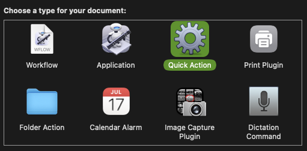
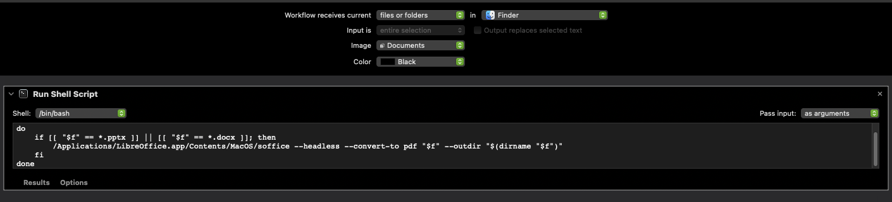

# Docx/PPTX to PDF Converter for macOS (Quick Action)

A Guide on how to make a macOS Quick Action that converts Microsoft Word (.docx) and PowerPoint (.pptx) files to PDF directly from Finder or even just from the Desktop.

## Features
- One-click conversion from Finder right-click menu
- Preserves original files
- Saves PDF in same folder as source file
- Supports batch conversion (select multiple files)
- Works with .docx and .pptx files

## Useful for
- Converting lecture notes from .docx to PDF
- Saving PowerPoint slides as PDF (preserves formatting)
- ANYONE who receives .pptx from teacher instead of a PDF (basically my motivation)


## Steps



1. Configure workflow at top:
- Workflow receives current **files or folders** in **Finder**
- Image: {use what image you want}


2. From Utilities, add "Run Shell Script"
- Drag it to the middle.
- Shell: **bin/bash**
- Pass input: **as arguments**

### Code bin/bash
```bash
for f in "$@"
do
    if [[ "$f" == *.pptx ]] || [[ "$f" == *.docx ]]; then
        /Applications/LibreOffice.app/Contents/MacOS/soffice --headless --convert-to pdf "$f" --outdir "$(dirname "$f")"
    fi
done
```

### So in summary, it must look like this


## Requirements
- **macOS** (tested on Ventura and later)
- **LibreOffice** (free, open-source)

## Installation

#### Using Homebrew
```bash
brew install --cask libreoffice
```

## Q&A
```
Q: Conversion takes too long?
A: First run is slower. Subsequent runs are faster.

Important location to delete some custom made Quick Action:
~/Library/Services/
```

<br>
<br>
<br>
<br>
<br>
<br>

# No Homebrew installed???, oh mannn
```bash
/bin/bash -c "$(curl -fsSL https://raw.githubusercontent.com/Homebrew/install/HEAD/install.sh)"
```

### After installation, add Homebrew to PATH (for Apple Silicon Macs)
```bash
echo 'eval "$(/opt/homebrew/bin/brew shellenv)"' >> ~/.zprofile
eval "$(/opt/homebrew/bin/brew shellenv)"
```

### For Intel Macs, use instead:
```bash
echo 'eval "$(/usr/local/bin/brew shellenv)"' >> ~/.zprofile
eval "$(/usr/local/bin/brew shellenv)"
```

# Verify installation
```bash
brew --version
```